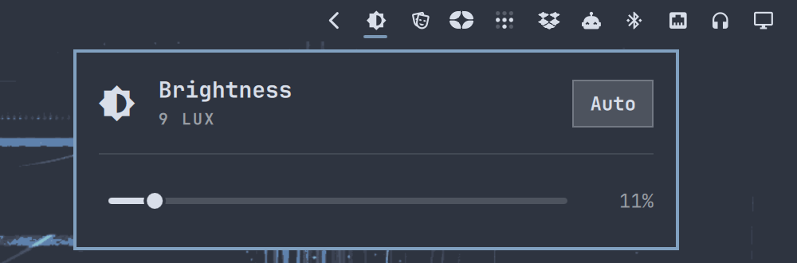
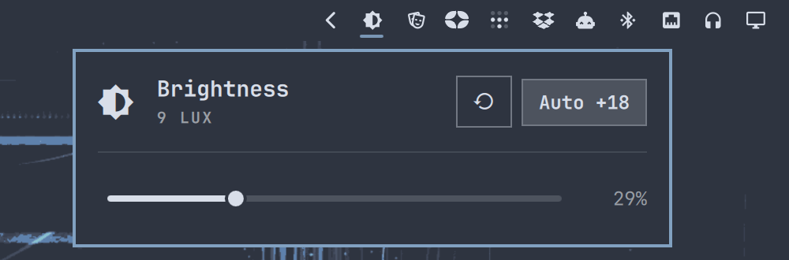

# Brightness

[](https://github.com/joaodrp/omarchy-auto-brightness/actions/workflows/ci.yml)
[](LICENSE)

Ambient-light auto brightness for Omarchy, as a bar widget. Apple Studio
Display only for now, because that is what it is tested on; see
[Other displays](#other-displays).



- Appears in the bar only while a supported display is connected.
- Auto follows the room the way macOS and Android do: smoothed lux,
  hysteresis and debounce, a log-shaped curve, a quick brighten and a slow
  dim.
- Auto learns. Any manual change, slider, wheel or hotkey, becomes your
  offset from the curve, shown on the chip as `Auto +8` and kept until you
  press the restore button beside it.



## Requirements

- An Apple Studio Display with its USB side connected, so Hyprland reports
  make `Apple Computer Inc` and the light sensor appears under
  `/sys/bus/iio`. The Pro Display XDR should work but is untested.
- `asdcontrol` and its passwordless sudo rule. Omarchy installs both.

## Install

```sh
omarchy plugin add https://github.com/joaodrp/omarchy-auto-brightness.git --enable
```

## Settings

Inline on the plugin's entry in `~/.config/omarchy/shell.json`, or via
Setup > Plugins:

| Key | Default | Meaning |
| --- | --- | --- |
| `auto` | `true` | Follow the room. The chip toggles it. |
| `offset` | `0` | Your correction to the curve, in brightness points. Manual changes rewrite it; restore clears it. |

IPC:

```sh
omarchy-shell auto-brightness status
omarchy-shell auto-brightness toggle   # also enable / disable
omarchy-shell auto-brightness forget   # clear the offset
omarchy-shell auto-brightness set 40   # as if you moved the slider
```

## How it works

Every half second the controller reads the display's light sensor and:

| Stage | |
| --- | --- |
| Smooth | Exponential average, settles in about 2 s. |
| Accept | Only a change of +10% or -20%, held for 4 s or 8 s. |
| Map | Lux to brightness, log-shaped: 5% in the dark, 24% at 100 lux, 100% at 5000. Plus `offset`. |
| Ramp | 20 points per second up, 13 down, capped at 2 s and 3 s, written one step per display write. The step is what the rate covers in one write's time, so the fade is as fine as the display allows. |

The evidence for each stage is in [docs/design.md](docs/design.md). The
loop structure started from
[miharekar/omarchy-studio-display-auto-brightness](https://github.com/miharekar/omarchy-studio-display-auto-brightness).

## Other displays

Four places pin the plugin to the Studio Display, and each is a small
change:

| What | Today | To generalise |
|------|-------|---------------|
| Display detection | The Apple test `omarchy-brightness-display` routes on | Accept the internal panel, or any output the helper can drive |
| Writes | `omarchy-brightness-display-apple` directly, to sidestep the routing helper's lock | Route by display type, as reads already do |
| Sensor discovery | IIO `als` device under the Apple USB path | Any IIO illuminance device, preferring one attached to the display |
| Lux unit | Fixed 0.001, because the Apple sensor reports millilux while the kernel scale reads 1.0 | Per-sensor: Apple gets 0.001, everything else the kernel's `in_illuminance_scale` |

The curve is anchored in nits, so another panel needs its own anchors but
not a new structure. Hysteresis, debounce, ramp and learning carry over
unchanged; the ramp measures the display's write latency and steps as
finely as that allows. Contributions with a display to test on are welcome.

Omarchy has open pull requests for built-in auto brightness. If one lands,
this plugin will shrink to whatever the built-in version does not cover.

## Known limits

- Hotkey changes are noticed within 10 s; each check is a `sudo asdcontrol`
  call, which the journal logs.
- Brightness only. The display has no colour temperature control over USB.
